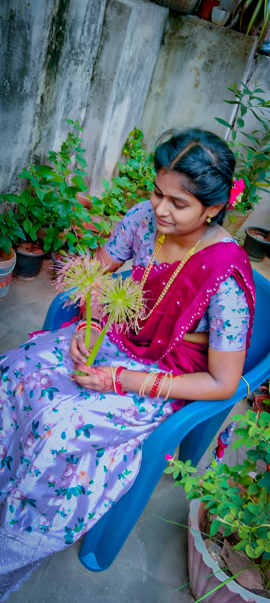

# Usha
<!DOCTYPE html>
<html lang="en">
<head>
<meta charset="UTF-8">
<meta name="viewport" content="width=device-width, initial-scale=1.0">
<title>Usha Kiran Naidu| Portfolio</title>

<link href="https://fonts.googleapis.com/css2?family=Poppins:wght@300;400;600;700&display=swap" rel="stylesheet">
<link href="https://cdnjs.cloudflare.com/ajax/libs/font-awesome/6.5.0/css/all.min.css" rel="stylesheet">

</head>
<body>

<nav>
    <h2>Appikatla.Usha Kiran Naidu </h2>
    <ul>
        <li><a href="about.html">About</a></li>
        <li><a href="skills.html">Skills</a></li>
        <li><a href="contact_me.html">Contact</a></li>
        
    </ul>
</nav>

<!-- Hero -->

    

    

        <h1>Hi, I'm Usha Kiran Naidu</h1>
        
soft skills Developer | Technical Educator

        <!-- DIRECT DOWNLOAD ENABLED -->
        <a href="Usha Kiran " download="Siva_Raghu_Resume.pdf" class="btn">
            <i class="fa fa-download"></i> Download Resume
        </a>

    

<footer>
    © 2026 Usha Kiran| All Rights Reserved
</footer>

</body>
</html>

